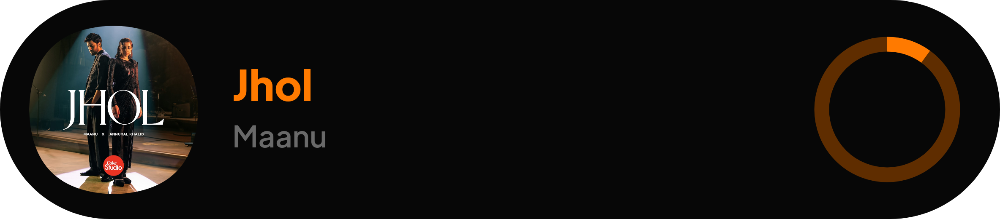

# 🎵 Vitality Music Bot

Vitality Music Bot is a feature-rich, Lavalink-powered music bot designed for high-quality, low-latency audio streaming on Discord. Built and maintained by **Badhon Vitality**, this bot supports Spotify, YouTube, SoundCloud, and more—with interactive UI, slash commands, autoplay, queue management, synced lyrics, and customizable behavior.

---

## 🚀 Features

- ✅ Slash Command Based
- 🎧 Supports Spotify / YouTube / SoundCloud
- 🌀 Autoplay
- 🔁 Loop/Repeat Modes
- 📃 Synced Lyrics (Live)
- 🎚 Volume Control
- 🔎 Search & Play via message or command
- 🎵 Fancy Music Card UI
- ⚙️ Powerful queue manager
- 🌐 Multilingual (Supports 10+ languages)
- 📦 MongoDB integration for storage
- 🧠 Custom help UI with buttons & select menus
- 🔄 Auto reconnect & error recovery

---

## 🌍 Supported Languages

- English (en)
- Spanish (es)
- French (fr)
- German (de)
- Chinese (Simplified) (cn)
- Japanese (ja)
- Korean (ko)
- Russian (ru)
- Portuguese (pt)
- Arabic (ar)
- Vietnamese (vi)

---

## 🔧 Installation

```bash
git clone https://github.com/badhonvitality/Vitality-bot.git
cd Vitality-bot
npm install
```

### 🛠 Setup

1. Rename `.env.example` to `.env` and add your bot token.
2. Configure `config.js`:
   - Add `mongoUri`
   - Add Spotify client credentials

### 🧪 Run the Bot

```bash
node index.js
```

---

## 📝 Environment Variables

| Variable | Description |
|----------|-------------|
| `TOKEN`  | Your Discord bot token |
| `MONGO_URI` | MongoDB connection string |
| `SPOTIFY_CLIENT_ID` | Your Spotify API client ID |
| `SPOTIFY_CLIENT_SECRET` | Your Spotify API client secret |

---

## 📸 Preview



---

## 📄 License

This project is licensed under the **MIT License**.  
You are free to use, modify, and redistribute it under the terms of the license.

```
MIT License

Copyright (c) 2025 Badhon Vitality

Permission is hereby granted, free of charge, to any person obtaining a copy
of this software and associated documentation files...
```

---

## 👨‍💻 Author

**Badhon Vitality**  
🌐 [GitHub](https://github.com/BadhonVitality)  
💬 For queries, join our support server or message on Discord: `badhonvitality`

---

## 📦 Credits

- Lavalink Node hosted and managed by **Badhon Vitality**
- Music UI Concepts by Badhon
- Discord.js Framework
- riffy & riffy-spotify integrations

---

## 🤝 Contributing

Contributions are welcome! Fork the repo, submit PRs, or open issues.

---

## 🌐 Web Interface (Optional)

A full-featured web dashboard is also available (if enabled). Check `index.html` and `player.js` for setup.

---